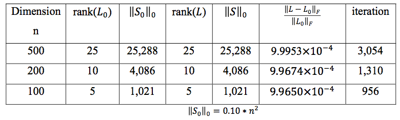
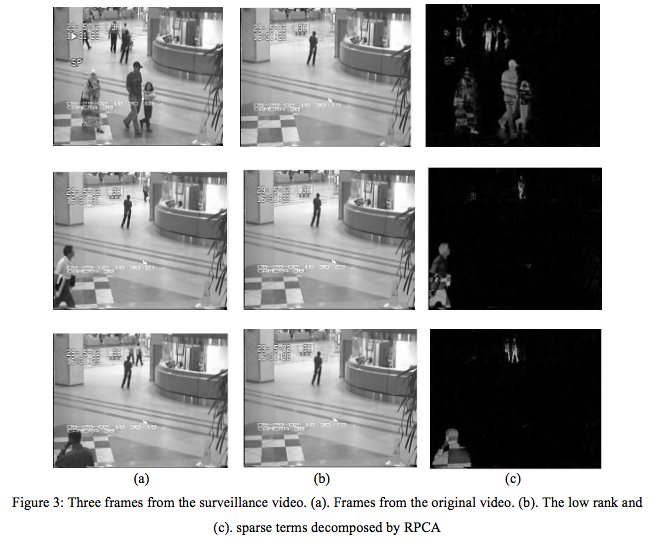
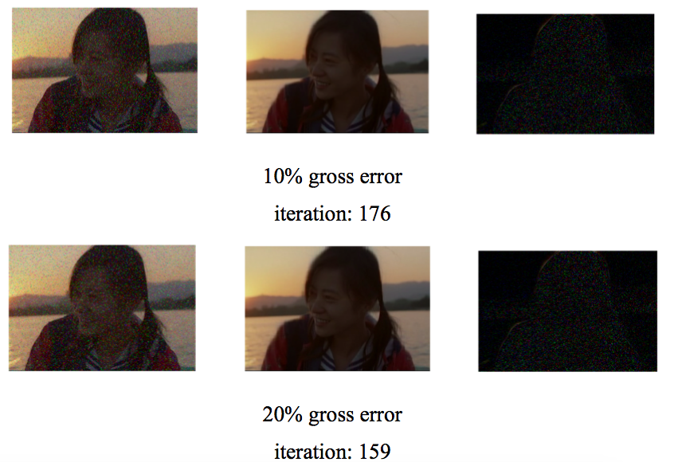

## Applications-of-tensor-robust-principal-component-analysis
 TRPCA for motion separation and denoseing
 
* RPCA_numerical.m 

numerical experiment for RPCA method

* main_rpca_image.m

Preprocessing of image

* RPCA.m

process surveillance videos and image by RPCA method

* generator_T.m

Generate low-rank components and sparse components for the numerical experiment

* main_video_t.m

Preprocessing of surveillance videos, vectorizing first 100 frames

* T_RPCA.m

The TRPCA approach for numerical experiment, image denoiseing and background modeling

* rank_1.m

compute the rank of tensors

* t_SVD.m

t-SVD with shrinkage

__Result:__

the low rank term L=P*Q, where P is n*r*n and Q is r*n*n and their elements are sampled independently from a normal 
distribution(0,1/n). The sparse term follows a Bernoulli model(1,0,-1). This table demonstrates recovery result for numerical matrices with varying sizes by TRPCA

Three frames from the surveillance video. (a). Frames from the original video. (b). The low rank and (c). sparse terms 
decomposed by RPCA

Removing random noise from images by TRPCA. The (a). corrupted image (b). recovery image and (c) sparse component extracted 
from an image.

